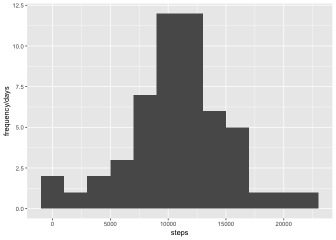
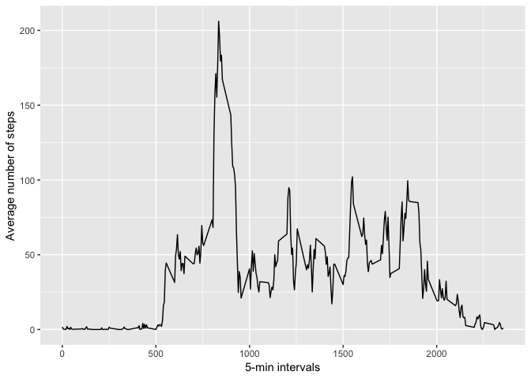
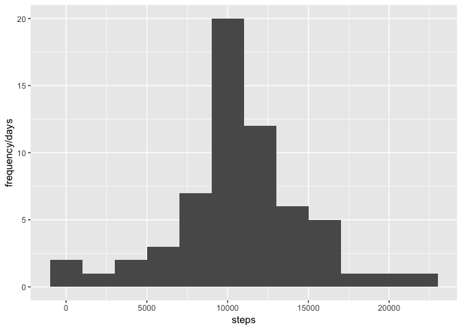
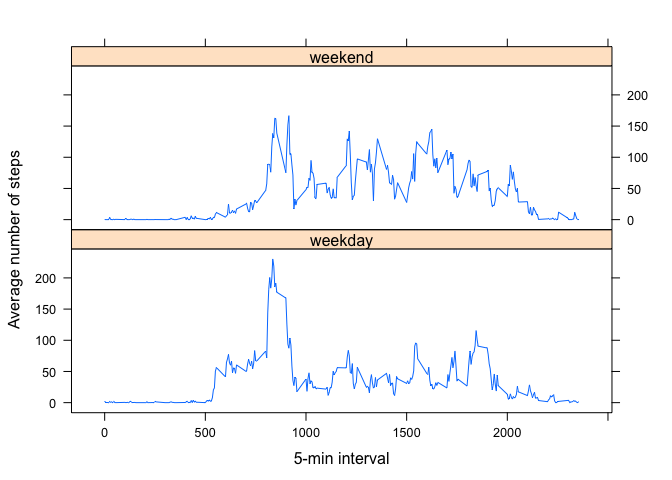

## Loading and preprocessing the data

```r
data <- read.csv("activity.csv")
data$date <- as.Date(data$date)
head(data)
```

```
##   steps       date interval
## 1    NA 2012-10-01        0
## 2    NA 2012-10-01        5
## 3    NA 2012-10-01       10
## 4    NA 2012-10-01       15
## 5    NA 2012-10-01       20
## 6    NA 2012-10-01       25
```

## What is mean total number of steps taken per day?

```r
library(dplyr)
```

```
## 
## Attaching package: 'dplyr'
```

```
## The following objects are masked from 'package:stats':
## 
##     filter, lag
```

```
## The following objects are masked from 'package:base':
## 
##     intersect, setdiff, setequal, union
```

```r
total_perday <- data %>% filter(!is.na(steps)) %>% 
  group_by(date) %>% 
  summarize(sum_steps = sum(steps))
head(total_perday)
```

```
## # A tibble: 6 x 2
##   date       sum_steps
##   <date>         <int>
## 1 2012-10-02       126
## 2 2012-10-03     11352
## 3 2012-10-04     12116
## 4 2012-10-05     13294
## 5 2012-10-06     15420
## 6 2012-10-07     11015
```

```r
mean_total <- mean(total_perday$sum_steps)
mean_total
```

```
## [1] 10766.19
```

```r
median_total <- median(total_perday$sum_steps)
median_total
```

```
## [1] 10765
```
As we've noticed, the mean total number of steps taken per day was calculated as 10766.19, the median is 10765, next we are gonna show the histogram of total number of steps. 


```r
#histogram of total number of steps each day
library(ggplot2)
ggplot(total_perday, aes(x=sum_steps)) +  labs(x="steps",y="frequency/days") +
     geom_histogram(binwidth = 2000)
```

<!-- -->


## What is the average daily activity pattern?

```r
timeseries <- data %>% filter(!is.na(steps)) %>% 
      group_by(interval) %>% summarize(mean_steps = mean(as.numeric(steps), na.rm = TRUE))

ggplot(timeseries, aes(interval, mean_steps)) + 
      labs(x="5-min intervals", y = "Average number of steps") + 
      geom_line()
```

<!-- -->

The average daily activity pattern looks like there is a peak at around interval 835, followed by relatively less active pattern throughout the rest of the day.

## Imputing missing values

```r
missingvalues <- data %>% filter(is.na(steps))
number_nas <- dim(missingvalues)[1]
print(paste0("there are ", number_nas, " missing values in the dataset"))
```

```
## [1] "there are 2304 missing values in the dataset"
```

```r
#figure out a strategy to fill in the NAs
mean_perinterval <- data %>% filter(!is.na(steps)) %>% 
   group_by(interval) %>% 
  summarize(mean_steps = mean(as.numeric(steps), na.rm = TRUE))

subset_na <- subset(x = data, is.na(data$steps))
subset_na$steps <- mean_perinterval$mean_steps[sapply(subset_na$interval, function(x)
  {which(x == mean_perinterval$interval)})]

data2 = data
data2[is.na(data$steps),] = subset_na
total_perday2 <- data2 %>% filter(!is.na(steps)) %>% 
  group_by(date) %>% 
  summarize(sum_steps = sum(steps))

mean_total2 <- mean(total_perday2$sum_steps)
mean_total2
```

```
## [1] 10766.19
```

```r
median_total2 <- median(total_perday2$sum_steps)
median_total2
```

```
## [1] 10766.19
```

```r
ggplot(total_perday2, aes(x=sum_steps)) +  labs(x="steps",y="frequency/days") +
     geom_histogram(binwidth = 2000)
```

<!-- -->

It turns out that the mean value after imputing the NAs stays the same but median value surprisingly changes to the same as mean value in this case.

## Are there differences in activity patterns between weekdays and weekends?

```r
data2$wdays <- factor(data2, levels = c("weekday", "weekend"))
weekdays = c("Monday", "Tuesday", "Wednesday", "Thursday", "Friday")
weekends = c("Saturday", "Sunday")
data2$wdays[weekdays(data2$date) %in% weekdays] <- "weekday"
data2$wdays[weekdays(data2$date) %in% weekends] <- "weekend"
mean_perinterval2 <- data2 %>% filter(!is.na(steps)) %>% 
   group_by(interval, wdays) %>% 
  summarize(mean_steps = mean(as.numeric(steps), na.rm = TRUE))
library(lattice)
xyplot(mean_steps ~ interval | wdays, data = mean_perinterval2, 
       xlab = "5-min interval", ylab = "Average number of steps",
       layout = c(1,2), type = "l", lty = 1)
```

<!-- -->

We can indeed notice some differences in the activity patterns: the weekend one starts at around 800 interval which is later than the weekday one, but the pattern is more active than the weekday one after the 1000 iterval. It seems to maintain the same level of activity throughout the whole intervals. For the weekday one, we notice there is a peak at around interval 800 but after the activity becomes less active.
